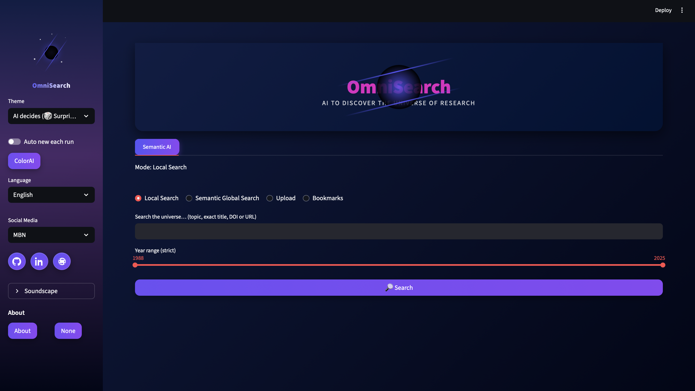
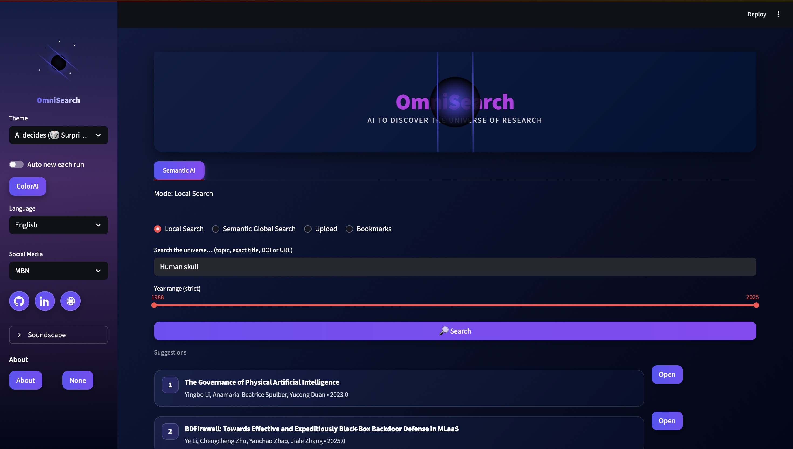
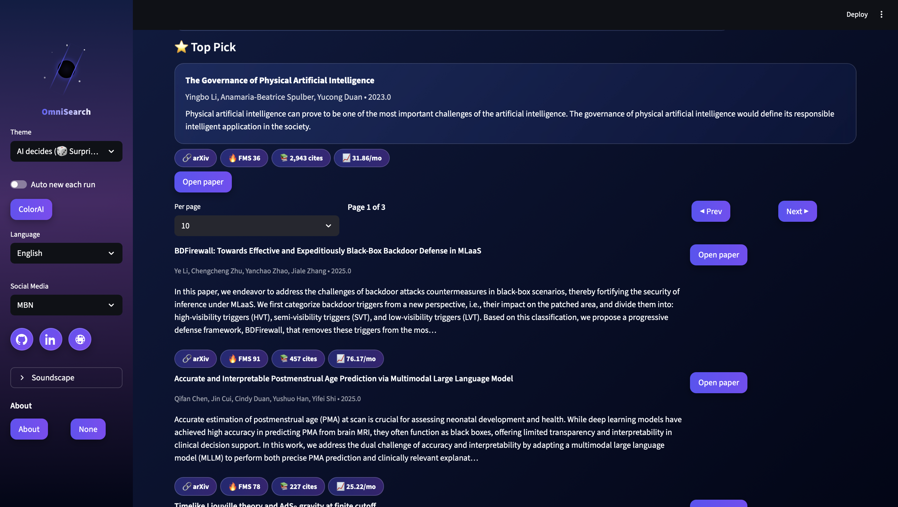
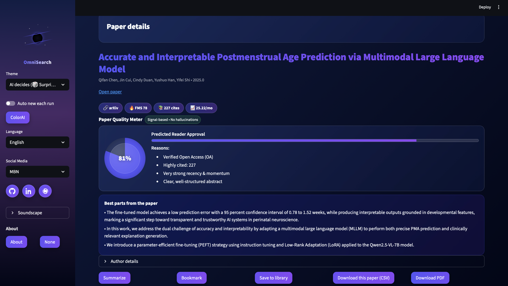
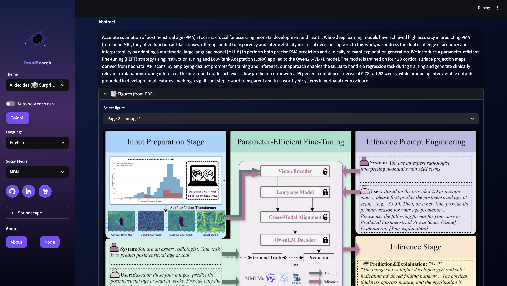
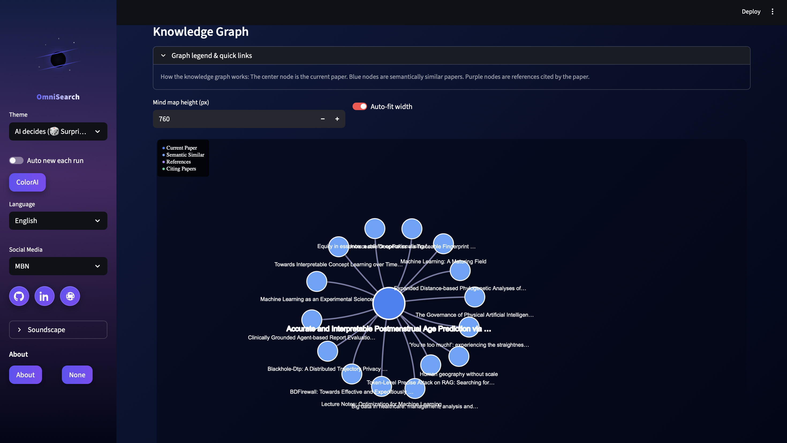

# OmniSearch-AI

Modern AI-Powered Research Discovery Platform designed to explore the universe of academic research intelligently.

Developed as a Thesis Defense Project
Final Thesis Defense Score: **93 / 100**

---

#  About The Project

OmniSearch-AI is an intelligent AI research exploration platform that helps users discover, analyze, enrich and interact with academic papers using modern AI technologies.

The platform combines:

* Semantic Search
* AI Research Analysis
* Citation Intelligence
* Knowledge Graphs
* Smart Research Chat
* Research Trend Discovery

into one unified modern research ecosystem.

---

# Features 

* AI-Powered Research Search
* Semantic Paper Discovery
* Smart Research Analysis
* Citation Enrichment
* Knowledge Graph Visualization
* AI Research Assistant Chat
* Research Trend Discovery
* Multi-source Research Exploration
* Intelligent Paper Processing
* PDF & Metadata Analysis
* AI News Fusion
* Bookmark System
* Interactive Research Insights
* Fast Streamlit Dashboard
* Modern UI Experience
* Animated Loader
* Responsive Design
* AI-driven Research Navigation

---

# Technologies Used 

## Backend & Core

* Python
* Streamlit
* Pandas
* NumPy
* JSON

## AI & Data Science

* NLP (Natural Language Processing)
* Semantic Search
* Citation Intelligence
* Knowledge Graphs
* AI Research Analysis

## Research & Visualization

* Interactive Data Visualization
* Research Metadata Processing
* Academic Source Integration

---

# Screenshots 

## Loader Screen


---

## Main Search Interface



---

## AI Research Discovery



---

## Semantic Research Results



---

## Intelligent Academic Exploration



---

## Knowledge Graph Visualization



---

## Advanced Research Insights



---

# Installation Guide (Mac) 

## 1. Clone Repository

```bash id="i1h4yi"
git clone https://github.com/baseetnaseri6/OmniSearch-AI.git
```

---

## 2. Open Project

```bash id="jz0y2e"
cd OmniSearch-AI
```

---

## 3. Create Virtual Environment

```bash id="v0aofj"
python3 -m venv .venv
```

---

## 4. Activate Environment

```bash id="6g0p7h"
source .venv/bin/activate
```

---

## 5. Install Requirements

```bash id="nh94i5"
pip install -r requirements.txt
```

---

## 6. Run Application

```bash id="a78ctm"
streamlit run main.py
```

Application runs on:

```bash id="hf5bs4"
http://localhost:8501
```

---

# Installation Guide (Windows) 

## 1. Install Python

Download:

https://python.org

IMPORTANT:

Enable:

[x] Add Python to PATH

---

## 2. Install VS Code

Download:

https://code.visualstudio.com/

Install extensions:

* Python
* Pylance

---

## 3. Clone Repository

```bash id="8e7j7s"
git clone https://github.com/baseetnaseri6/OmniSearch-AI.git
```

---

## 4. Open Project

```bash id="h7q7t1"
cd OmniSearch-AI
```

---

## 5. Create Virtual Environment

```bash id="4w3v2y"
python -m venv .venv
```

---

## 6. Activate Environment

```bash id="st7lkt"
.venv\Scripts\activate
```

---

## 7. Install Requirements

```bash id="ag9r5m"
pip install -r requirements.txt
```

---

## 8. Run Application

```bash id="jlwmna"
streamlit run main.py
```

---

# Future Improvements 

* LLM Integration
* AI Research Recommendation Engine
* Personalized Research Feed
* Advanced Knowledge Graph Analytics
* AI-generated Research Summaries
* Multi-user Collaboration
* Cloud Deployment
* Research Trend Prediction
* Voice AI Assistant
* Research Citation Scoring
* Vector Database Integration

---

# Skills Demonstrated 

* AI Research Systems
* Semantic Search
* NLP Concepts
* Streamlit Development
* Python Application Development
* Knowledge Graph Design
* Research Metadata Processing
* Interactive Dashboard UI
* AI-powered Information Retrieval
* Research Intelligence Systems

---

# Thesis Information 🎓

This project was developed as a final Thesis Defense Project focused on:

* AI-powered Research Discovery
* Intelligent Academic Exploration
* Semantic Research Navigation
* Citation Intelligence

Final Thesis Defense Score:

# ⭐ 93 / 100

---

# Author 

Mohammad Baseet Naseri

* Data Scientist
* AI Engineer
* Full-Stack Developer


Portfolio
https://naseriai.com

LinkedIn:
https://linkedin.com/in/baseetnaseri6

GitHub:
https://github.com/baseetnaseri6

---

# License 

MIT License
